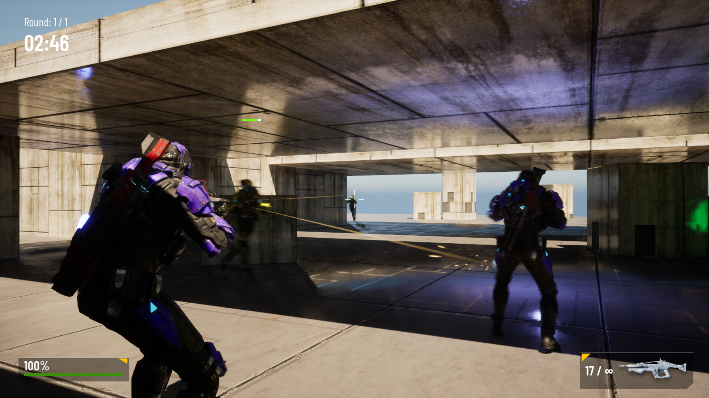

# Unreal Shooter Course Project

A shooter game project made as part of the ["Unreal Engine: Complete Guide to C++ Development"](https://www.udemy.com/course/unrealengine/?couponCode=KEEPLEARNING) course.

Features:
- TPS character, camera and controls
- AI players behavior
- Custom Game Modes
- 2 types of weapon
- 2 types of pickups
- UI, VFX and sounds

[Gameplay](https://drive.google.com/file/d/1fI63SLGc6TLcUD8osuTyy0YZ2kdydRLY/view?usp=sharing)
